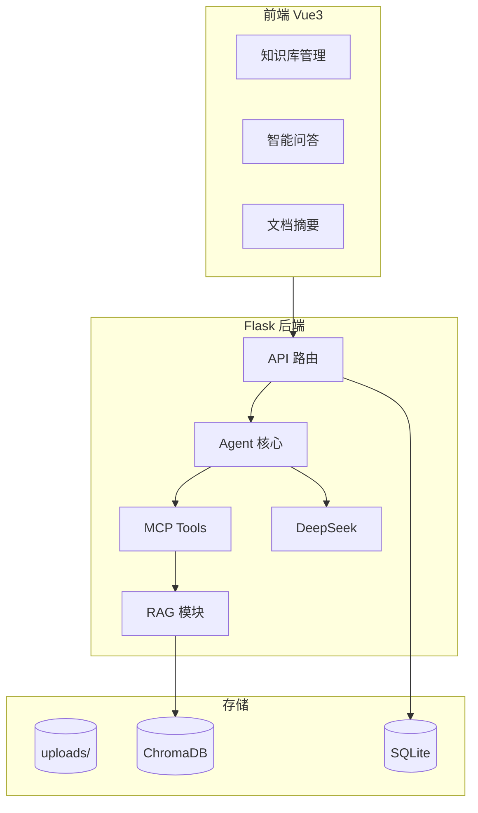
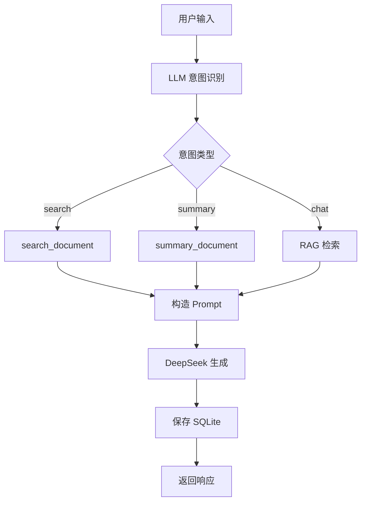

# 系统架构

## 系统架构图

```mermaid
flowchart TB
    subgraph Frontend["前端 Vue3"]
        P1[知识库管理]
        P2[智能问答]
        P3[文档摘要]
    end
    subgraph Backend["Flask 后端"]
        ROUTES[API 路由]
        AGENT[Agent 核心]
        RAG[RAG 模块]
        TOOLS[MCP Tools]
        LLM[DeepSeek]
    end
    subgraph Storage["存储"]
        UPLOADS[(uploads/)]
        CHROMA[(ChromaDB)]
        SQLITE[(SQLite)]
    end
    Frontend --> ROUTES
    ROUTES --> AGENT
    AGENT --> TOOLS
    AGENT --> LLM
    TOOLS --> RAG
    RAG --> CHROMA
    ROUTES --> SQLITE
```

## Agent 执行流程

```mermaid
flowchart TD
    A[用户输入] --> B[LLM 意图识别]
    B --> C{意图类型}
    C -->|search| D[search_document]
    C -->|summary| E[summary_document]
    C -->|chat| F[RAG 检索]
    D --> G[构造 Prompt]
    E --> G
    F --> G
    G --> H[DeepSeek 生成]
    H --> I[保存 SQLite]
    I --> J[返回响应]
```
